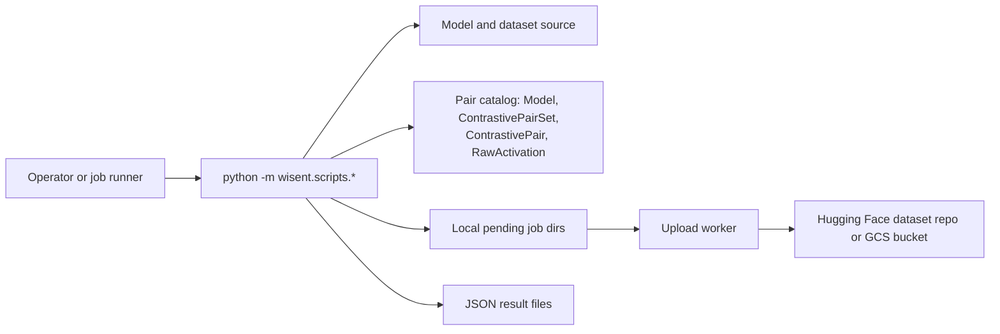

<!-- wisent-banner:start -->
<p align="center">
  
</p>
<!-- wisent-banner:end -->

<!-- wisent-readme-signals:start -->
[](https://github.com/wisent-ai/wisent-tools) [](https://github.com/wisent-ai/wisent-tools/issues) [](https://wisent.com) [](https://discord.gg/qRjpkthq54) [](https://www.linkedin.com/company/wisent-ai/) [](https://x.com/wisentai) [](https://calendly.com/lbartoszcze)
<!-- wisent-readme-signals:end -->

# Wisent Tools

Monitor and Control Your AI Agent Brain.

You look at what your model says. But what was it actually thinking? Wisent shows
you how to use information from AI activations, intermediate steps within its
layers, to your advantage. Wisent is a full toolkit for representation
engineering, activation steering and mechanistic interpretability. Cut
hallucination rates, decensor your model or stop it from being detected by
AI-generated text detectors. Your Models — Yours to Control. Better than
fine-tuning. Better than analysing the outputs directly.

Deploy the latest research in your stack. This is the operational companion package:
the runners, sweeps and shared helpers the family uses.

It is not the core `wisent` model/steering library, not a hosted evaluation
service, and not a stable umbrella CLI. Most modules are specialized operator
workflows with heavyweight runtime and infrastructure dependencies.

[Install](#quick-start) · [Released surface](#released-versus-source-surface) ·
[Stado boundary](#stado-object-interface) ·
[Canonical repository](https://github.com/wisent-ai/wisent-tools)

Current boundary: `wisent-tools` 0.1.111 is present on PyPI and supports Python
3.9+. **The repository has no `LICENSE` file and declares no package license.**
Public source and registry availability do not grant a general right to copy,
modify, or redistribute it. Obtain an explicit license before redistribution or
derivative use.

## Problem and intended users

The core Wisent library should not absorb one-off benchmark runners, database
migration helpers, GPU extraction jobs, or infrastructure transfer code. Those
workflows still need versioned imports, one namespace, and explicit boundaries
for private model/dataset inputs and generated evidence.

Wisent Tools serves:

- **Wisent researchers** running AIME, APPS, CoNaLa, LiveMathBench, MATH,
  PolyMath, and related evaluation utilities;
- **activation-pipeline operators** extracting missing hidden-state records and
  uploading raw activations;
- **Stado workload authors** materializing immutable private model/dataset inputs
  and publishing create-only JSON results;
- **platform operators** moving provider-neutral object trees and receiving
  consistent, machine-meaningful failure codes.

## Product boundaries

### Included

- Python namespace modules under `wisent.scripts`;
- benchmark-evaluation runners and constant-analysis/reorganization utilities;
- raw and processed activation extraction/upload helpers;
- quality-metrics sweep orchestration around the core `wisent` CLI;
- `wisent.stado.StadoClient` for authenticated object get/put/list/stat/delete and
  tree/prefix transfer;
- `wisent.stado_inputs` for SHA-256-verified private model/dataset materialization
  and immutable evaluation results;
- `wisent.failure` for stable dependency failure codes, retry semantics, safe
  human messages, and redacted operator logs;
- namespace coexistence with sibling `wisent-*` distributions.

### Explicit non-goals and limitations

- This package does not provide the main `wisent` command or core steering/model
  implementation; it depends on `wisent>=0.11.21`.
- Installing the package does not provision models, datasets, GPUs, Stado,
  Supabase/PostgreSQL, Hugging Face caches, or credentials.
- Many operator scripts import undeclared workflow dependencies such as PyTorch,
  Transformers, psycopg2, NumPy, datasets, or task-specific evaluators. The three
  declared dependencies are not a complete environment lock.
- There is no lockfile and no supported claim that every historical runner works
  with the newest transitive dependencies.
- Scripts can allocate large models, GPU memory, activation tensors, database
  rows, files, and object-storage traffic. Treat them as data/compute jobs, not
  lightweight library calls.
- Benchmark datasets and model artifacts have their own licenses and access
  terms. This repository does not grant rights to them.
- Some scripts are operational snapshots tied to Wisent database schemas and
  internal infrastructure; they are not stable public APIs merely because they
  are importable.
- The source tree can contain functionality not present in the latest published
  sdist. Do not infer availability from repository files alone.
- No package license is currently granted. This is a release blocker for safe
  external reuse and redistribution.

## Released versus source surface

`released-surface.json` records the public/importable surface extracted from the
published PyPI 0.1.111 source distribution. That release contains:

- activation Supabase helper exports;
- activation extraction, migration, and upload modules;
- benchmark runners for AIME, APPS, CoNaLa, LiveMathBench, MATH, and PolyMath;
- constant-analysis, dead-constant, reorganization, extraction, and fixer
  modules;
- the quality-metrics sweep shell script;
- an activation-extraction coverage-universe entry point supplied by the broader
  package family.

The current checkout also contains `wisent.stado`, `wisent.stado_inputs`, and
`wisent.failure`. They are described below because they are implemented source,
but they are **not listed in the recorded PyPI 0.1.111 released surface**. Pin and
inspect the exact distribution/revision required by an operational workflow.

## Core use cases

### Run a released benchmark module

- **Actor:** a researcher with an approved model/dataset environment.
- **Initial state:** the exact `wisent-tools` and compatible `wisent` versions plus
  task dependencies are installed.
- **Outcome:** a runner evaluates its named benchmark and writes that runner's
  result surface.
- **Boundary:** benchmark correctness, dataset licensing, prompts, scoring, and
  hardware behavior are runner-specific; there is no single universal output
  contract in this README.

### Extract missing activations

- **Actor:** an activation-pipeline operator.
- **Initial state:** immutable model input, database schema/credentials, compatible
  model libraries, and GPU/CPU device are available.
- **Outcome:** missing contrastive-pair activations are computed and persisted.
- **Boundary:** these scripts can modify production-like database state and can
  consume substantial compute. Review arguments and schema before execution.

### Move operator objects through Stado

- **Actor:** a platform/workload author using current source.
- **Initial state:** outside a machine job, `STADO_API_URL` and
  `STADO_API_TOKEN` identify an authorized Stado object API.
- **Outcome:** validated `stado://namespace/key` objects or bounded local trees
  move through the provider-neutral API.
- **Boundary:** machine jobs are prohibited from making remote Stado calls; inputs
  must be pre-staged and outputs written under the job output boundary.

### Materialize immutable private inputs

- **Actor:** a workload running current source.
- **Initial state:** model/dataset URI and expected SHA-256 environment variables
  point inside the `wisent-tools` namespace.
- **Outcome:** archives are downloaded outside a machine job or consumed from
  pre-staged inputs, verified, and safely extracted.
- **Boundary:** digest equality proves byte identity, not artifact safety,
  provenance, model behavior, or license.

## How it works

`wisent-tools` ships no service and no daemon. Every capability is a module you
start yourself, so the process you launch is the only actor: it reads its
credentials from its own environment, holds a model in local memory, and drives
external systems it does not own — a model/dataset source, the Wisent pair
catalog, an artifact store, and, for the sweep, the core `wisent` CLI.



- **Durable state:** nothing durable lives inside the package. Activation work
  persists as rows in the Wisent PostgreSQL/Supabase catalog — the `Model`,
  `ContrastivePairSet`, `ContrastivePair`, and `RawActivation` tables — and
  coverage is recomputed from `RawActivation` counts rather than from local
  bookkeeping, which is what makes an interrupted extraction resumable. Packed
  activation shards stage in per-job directories under
  `$TMPDIR/wisent_raw_pending`, optionally spilled to
  `$WISENT_RAW_COLD_PENDING_ROOT` under disk pressure, and are deleted only
  after a successful publish to a Hugging Face dataset repository or a `gs://`
  prefix. Benchmark runners are the exception worth knowing: each writes its
  JSON result to a fixed filename in a `results_test_evaluator/` directory
  beside its own module inside the installed package, overwriting the previous
  run, with no configurable output directory.
- **Credential boundary:** every credential is supplied by the process you
  start; the package brokers, caches, and rotates none of them. `DATABASE_URL`
  is read at import time by the extraction helpers and its absence aborts the
  process immediately. `SUPABASE_ACCESS_TOKEN` is preferred, falling back to a
  `config/supabase_access_token` object in `$WC_BUCKET` read with ambient Google
  credentials, then on macOS to the Keychain entry the Supabase CLI writes.
  `HF_TOKEN` authenticates Hub reads and existence checks, and Google Cloud
  access is ambient application-default credentials. A token leaves the process
  only as an `Authorization: Bearer` header to the Supabase Management API or
  inherited by the tool that owns it — `huggingface_cli`, `gcloud storage`, the
  GCS client. Nothing is written back into the repository or a config file.
- **Network boundary:** the package binds no port and accepts no inbound
  connection; every connection is outbound and initiated by your process. The
  required destinations are the PostgreSQL endpoint named in `DATABASE_URL` (a
  Supabase pooler port `6543` is rewritten to `5432`, with a 30-second connect
  timeout and TCP keepalives), `api.supabase.com/v1/projects/<ref>/database/query`
  for catalog SQL, the Hugging Face Hub for model/dataset loading and for
  `upload-large-folder` publication, and Google Cloud Storage for sweep results,
  cold-tier configuration, and the shared commit-rate object. Model loading
  passes `trust_remote_code=True`, so a model repository's own code executes in
  your process.
- **Failure boundary:** database writes retry a caller-supplied `--max-retries`
  times, reconnecting between attempts and raising on the last one; a stale
  connection is detected by a `SELECT 1` probe and replaced. Publication fails
  closed. Staged files install create-only and raise
  `immutable staged object conflict` instead of overwriting; result JSON is
  written through a temporary file; published bytes are re-read and compared by
  SHA-256, and completion markers are published only as a separate second phase,
  so a marker never precedes verified data. Hub commits must first reserve a slot
  from a fleet-wide rolling-hour counter capped at 120 commits, and a job that
  cannot get one fails rather than committing ungated. An upload worker
  distinguishes the two cases: a validation or immutability conflict is terminal
  and stops immediately, while any other error backs off exponentially for up to
  20 attempts, and a stalled child is killed after `WISENT_UPLOAD_STALL_S`
  (default 900 seconds). Pending job directories outlive a restart and a later
  sweep respawns a worker for them. The quality-metrics sweep deliberately does
  not fail closed: it runs without `set -e`, appends each failure to a failed
  list, and continues, so process exit `0` does not mean every benchmark
  succeeded — read its failed/completed lists. Restoring database or object-store
  state, and re-running a benchmark that failed mid-sweep, require operator
  action.

See [Architecture](#architecture) for the module layout behind this model.

## Architecture

```text
wisent-tools distribution (shared `wisent` namespace)
  │
  ├─ wisent.scripts
  │    ├─ benchmark_evaluation/*
  │    ├─ activations/*
  │    ├─ extract_* / fix_*
  │    └─ run_quality_metrics_sweep.sh
  │
  ├─ wisent.stado             current source object client / CLI
  ├─ wisent.stado_inputs      current source immutable input/result boundary
  └─ wisent.failure           current source failure taxonomy

external owners:
  wisent core/evaluators · Stado API · model/dataset stores · PostgreSQL/Supabase
  · PyTorch/Transformers/Hugging Face · GPU/worker runtime
```

The package uses `pkgutil.extend_path` because several distributions contribute
modules under the `wisent` namespace. Import behavior therefore depends on the
complete installed package set, not this wheel alone.

## Quick start

### Prerequisites

- Python 3.9 or newer;
- an isolated virtual environment;
- access to PyPI or an approved package mirror;
- explicit approval for this unlicensed package's intended use;
- workflow-specific dependencies, data, credentials, and hardware.

```bash
python -m venv .venv
source .venv/bin/activate
python -m pip install "wisent-tools==0.1.111"
```

Confirm the installed distribution rather than assuming the checkout and PyPI
artifact are identical:

```bash
python -c 'from importlib.metadata import version; print(version("wisent-tools"))'
```

Expected result: `0.1.111` for the command above. Installation alone does not
make any benchmark or extraction workflow ready.

For repository development/source inspection:

```bash
git clone https://github.com/wisent-ai/wisent-tools.git
cd wisent-tools
python -m pip install -e .
```

An editable checkout exposes current source, including modules that may be absent
from the recorded published surface. Do not use editable installs for reproducible
production jobs.

## Primary interfaces

### Released runnable modules

Representative module invocation:

```bash
python -m wisent.scripts.benchmark_evaluation.math_coding.run_aime_evaluation --help
```

Use `released-surface.json` for the exact 0.1.111 module list. Each runner owns
its arguments and output; inspect its `--help` and source before launching a
costly or stateful job.

### Activation extraction

The current raw extraction path requires an immutable model URI/digest:

```bash
export STADO_MODEL_URI='stado://wisent-tools/models/<archive>.tar.gz'
export STADO_MODEL_SHA256='<64-lowercase-hex-sha256>'
python -m wisent.scripts.extract_raw_activations \
  --device cuda \
  --max-retries 3 \
  --log-interval 25
```

This path loads a local-only Transformers model after Stado materialization and
writes to the configured activation database. The example is a contract shape,
not permission to run it against production data.

### Quality-metrics sweep

`wisent/scripts/run_quality_metrics_sweep.sh` requires immutable model and dataset
URIs/digests plus `SWEEP_ID`. It runs a fixed benchmark/synthetic suite around
`wisent optimize-steering`, persists intermediate output, resumes from marker
files, and intentionally continues after individual failures.

A completed shell process can therefore contain failed benchmark entries. Inspect
its combined result and failed/completed lists rather than treating process
completion alone as success.

## Stado object interface

Current source provides:

```python
from wisent.stado import StadoClient

client = StadoClient()  # reads STADO_API_URL and STADO_API_TOKEN
objects = client.list_uri("stado://wisent-tools/evaluations")
```

`StadoClient` supports:

- `get_bytes`, `get_text`, `get_json`, and atomic `get_file`;
- `put_bytes`, canonical `put_json`, streamed `put_file`, and create-only
  `if_absent` writes;
- `stat`, `list`, `list_uri`, and `delete`;
- symlink-rejecting `put_tree` and traversal-filtering `get_prefix`.

The URL must be absolute HTTP(S), contain no embedded credentials/query/fragment,
and use HTTPS except authenticated loopback. `stado://` URIs are validated before
requests. The bearer token is sent in the `Authorization` header.

CLI surface in current source:

```bash
python -m wisent.stado list stado://<namespace>/<prefix>
python -m wisent.stado has-prefix stado://<namespace>/<prefix>
python -m wisent.stado put-tree stado://<namespace>/<prefix> <directory>
python -m wisent.stado put-tree --sync stado://<namespace>/<prefix> <directory>
python -m wisent.stado get-prefix stado://<namespace>/<prefix> <directory>
```

`has-prefix` reserves exit `1` for a legitimate absent answer. Retryable dependency
failure exits `69`; invalid configuration/input and non-retryable errors use the
failure contract instead of masquerading as absence.

## Immutable private-input contract

Current `wisent.stado_inputs` recognizes product-owned paths:

- `stado://wisent-tools/models/...` with `STADO_MODEL_URI` and
  `STADO_MODEL_SHA256`;
- `stado://wisent-tools/datasets/...` with dataset URI/digest variables;
- `stado://wisent-tools/evaluations/<STADO_EVALUATION_ID>/<file>.json` for
  create-only result publication.

Archive extraction accepts regular files/directories only and rejects traversal,
links, devices, and unsafe members. A machine job (`WC_JOB_ID` present) must use
pre-staged inputs and writes immutable results to `STADO_JOB_OUTPUT_DIR` or
`./output`; an operator process can use the authenticated Stado API.

## Failure semantics

`wisent.failure` classifies configuration, authentication, not-found, rate-limit,
timeout, infrastructure-down, and unknown failures. A classification carries
service, impact, severity, retryability, outage status, and an exit-code decision.

Sensitive key/token/password fragments are redacted from the structured operator
line. User-facing messages omit raw upstream bodies. Debug traceback output must
still be treated as potentially sensitive.

## Security, privacy, and data handling

- Never commit or print `STADO_API_TOKEN`, database URLs, Supabase keys, model
  credentials, Hugging Face tokens, or customer dataset locations.
- Activation tensors and contrastive pairs can encode sensitive source prompts or
  model behavior. Apply access control, retention, deletion, and export policy.
- Verify exact SHA-256 values from an independent trusted manifest; do not accept
  a digest supplied beside an untrusted artifact as provenance.
- `put-tree --sync` deletes remote objects missing locally. Review the namespace
  and source tree before using it.
- Evaluation/result writes are intended to be immutable. A conflicting payload
  at the same URI is an error, not an overwrite path.
- Machine workloads must not bypass pre-staging by calling Stado directly.
- Database-writing extraction scripts require least-privilege credentials and a
  schema backup/recovery plan.
- Logs can expose model URIs, benchmark names, row counts, timings, paths, and
  diagnostics. Do not attach them unredacted to public issues.
- Model and dataset code/artifacts may execute loaders or contain unsafe formats;
  digest verification alone does not sandbox deserialization.

## Operational model

- **Configuration:** runner arguments plus workflow-specific environment for
  Stado, database, immutable input digests, output directories, and compute.
- **State:** database rows, local caches/temp directories, Stado objects, sweep
  progress, and generated result artifacts.
- **Credentials:** externally supplied; no broker or secret rotation is provided.
- **Observability:** runner stdout/stderr, classified failure lines, database
  progress, intermediate result files, and object metadata.
- **Recovery:** preserve immutable inputs, rerun idempotent/create-only stages,
  inspect partial benchmark failures, and restore database/object state using the
  owning service's procedures.
- **Cost:** model storage/transfer, GPU/CPU runtime, database writes, object
  retention, and operator review. The package has no checkout or metering.

## Project status and support

- **Maturity:** published operational package with a heterogeneous script surface;
  not a single stable product API.
- **Latest recorded distribution:** PyPI `wisent-tools` 0.1.111; consult PyPI for
  the current registry state before installing.
- **Compatibility:** Python 3.9+; each operator workflow has additional unpinned
  runtime constraints.
- **Issues:** [`wisent-ai/wisent-tools`](https://github.com/wisent-ai/wisent-tools/issues).
- **Security:** use private GitHub Security Advisories; never include credentials,
  private object URIs, model/dataset contents, activations, database excerpts, or
  unredacted logs in a public issue.
- **License:** **none declared in the repository or package metadata.** Do not
  infer redistribution or derivative-work permission from public visibility or
  PyPI publication. Obtain an explicit license from the rights holder.
