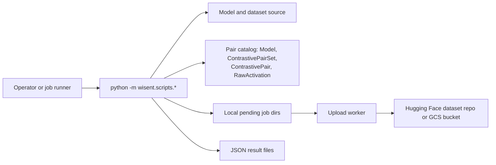

<!-- Moved out of README.md; the README links here. -->
## How it works

`wisent-tools` ships no service and no daemon. Every capability is a module you
start yourself, so the process you launch is the only actor: it reads its
credentials from its own environment, holds a model in local memory, and drives
external systems it does not own — a model/dataset source, the Wisent pair
catalog, an artifact store, and, for the sweep, the core `wisent` CLI.



- **Durable state:** nothing durable lives inside the package. Activation work
  persists as rows in the Wisent PostgreSQL/Supabase catalog — the `Model`,
  `ContrastivePairSet`, `ContrastivePair`, and `RawActivation` tables — and
  coverage is recomputed from `RawActivation` counts rather than from local
  bookkeeping, which is what makes an interrupted extraction resumable. Packed
  activation shards stage in per-job directories under
  `$TMPDIR/wisent_raw_pending`, optionally spilled to
  `$WISENT_RAW_COLD_PENDING_ROOT` under disk pressure, and are deleted only
  after a successful publish to a Hugging Face dataset repository or a `gs://`
  prefix. Benchmark runners are the exception worth knowing: each writes its
  JSON result to a fixed filename in a `results_test_evaluator/` directory
  beside its own module inside the installed package, overwriting the previous
  run, with no configurable output directory.
- **Credential boundary:** every credential is supplied by the process you
  start; the package brokers, caches, and rotates none of them. `DATABASE_URL`
  is read at import time by the extraction helpers and its absence aborts the
  process immediately. `SUPABASE_ACCESS_TOKEN` is preferred, falling back to a
  `config/supabase_access_token` object in `$WC_BUCKET` read with ambient Google
  credentials, then on macOS to the Keychain entry the Supabase CLI writes.
  `HF_TOKEN` authenticates Hub reads and existence checks, and Google Cloud
  access is ambient application-default credentials. A token leaves the process
  only as an `Authorization: Bearer` header to the Supabase Management API or
  inherited by the tool that owns it — `huggingface_cli`, `gcloud storage`, the
  GCS client. Nothing is written back into the repository or a config file.
- **Network boundary:** the package binds no port and accepts no inbound
  connection; every connection is outbound and initiated by your process. The
  required destinations are the PostgreSQL endpoint named in `DATABASE_URL` (a
  Supabase pooler port `6543` is rewritten to `5432`, with a 30-second connect
  timeout and TCP keepalives), `api.supabase.com/v1/projects/<ref>/database/query`
  for catalog SQL, the Hugging Face Hub for model/dataset loading and for
  `upload-large-folder` publication, and Google Cloud Storage for sweep results,
  cold-tier configuration, and the shared commit-rate object. Model loading
  passes `trust_remote_code=True`, so a model repository's own code executes in
  your process.
- **Failure boundary:** database writes retry a caller-supplied `--max-retries`
  times, reconnecting between attempts and raising on the last one; a stale
  connection is detected by a `SELECT 1` probe and replaced. Publication fails
  closed. Staged files install create-only and raise
  `immutable staged object conflict` instead of overwriting; result JSON is
  written through a temporary file; published bytes are re-read and compared by
  SHA-256, and completion markers are published only as a separate second phase,
  so a marker never precedes verified data. Hub commits must first reserve a slot
  from a fleet-wide rolling-hour counter capped at 120 commits, and a job that
  cannot get one fails rather than committing ungated. An upload worker
  distinguishes the two cases: a validation or immutability conflict is terminal
  and stops immediately, while any other error backs off exponentially for up to
  20 attempts, and a stalled child is killed after `WISENT_UPLOAD_STALL_S`
  (default 900 seconds). Pending job directories outlive a restart and a later
  sweep respawns a worker for them. The quality-metrics sweep deliberately does
  not fail closed: it runs without `set -e`, appends each failure to a failed
  list, and continues, so process exit `0` does not mean every benchmark
  succeeded — read its failed/completed lists. Restoring database or object-store
  state, and re-running a benchmark that failed mid-sweep, require operator
  action.

See [Architecture](#architecture) for the module layout behind this model.

## Architecture

```text
wisent-tools distribution (shared `wisent` namespace)
  │
  ├─ wisent.scripts
  │    ├─ benchmark_evaluation/*
  │    ├─ activations/*
  │    ├─ extract_* / fix_*
  │    └─ run_quality_metrics_sweep.sh
  │
  ├─ wisent.stado             current source object client / CLI
  ├─ wisent.stado_inputs      current source immutable input/result boundary
  └─ wisent.failure           current source failure taxonomy

external owners:
  wisent core/evaluators · Stado API · model/dataset stores · PostgreSQL/Supabase
  · PyTorch/Transformers/Hugging Face · GPU/worker runtime
```

The package uses `pkgutil.extend_path` because several distributions contribute
modules under the `wisent` namespace. Import behavior therefore depends on the
complete installed package set, not this wheel alone.

